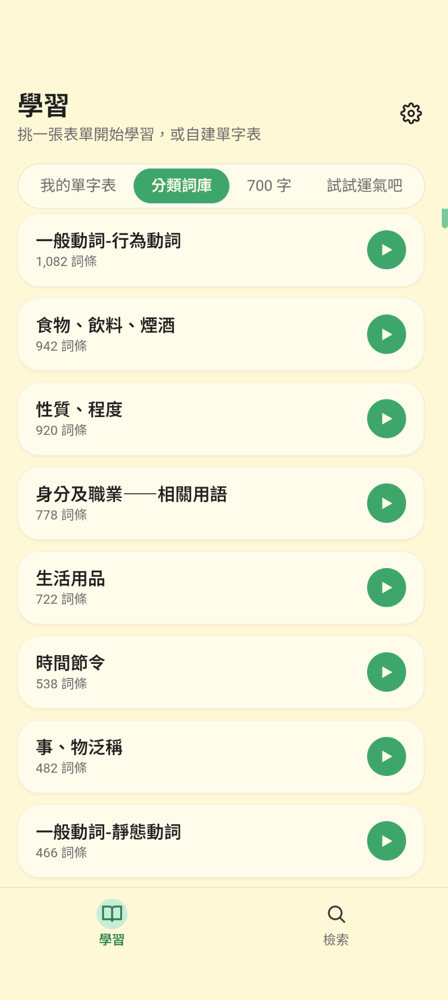
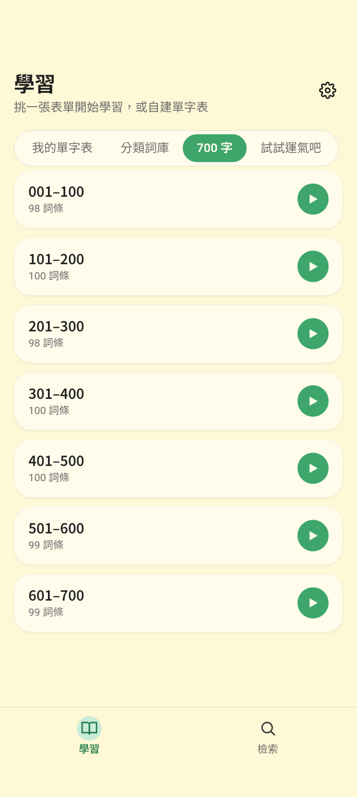
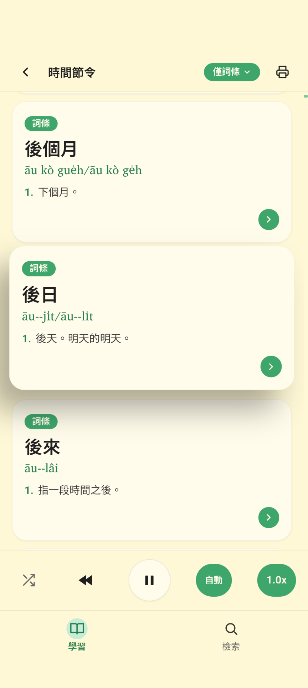
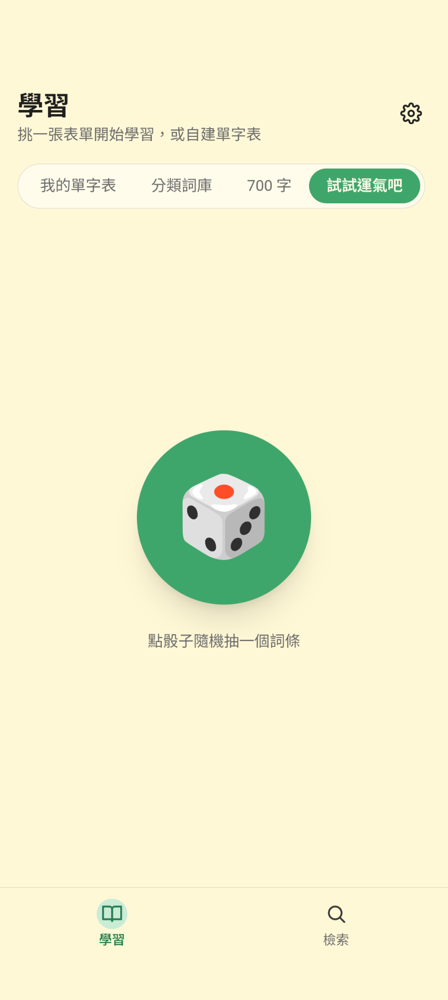
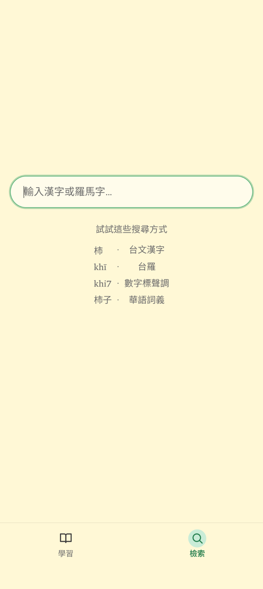
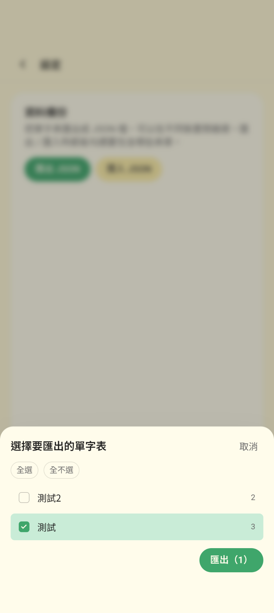

# 貓咪辭典 Kitty Dict — DIY 你的台語辭典

**貓咪辭典**（英文名 **Kitty Dict**）是一套幫你**打造個人化台語辭典**的開源框架。資料源自[教育部臺灣台語常用詞辭典](https://sutian.moe.edu.tw/)，所有檢索、播放、單字表、列印、匯出邏輯都開放給你修改、重新打包。

> **目前狀態**：行動端 app 暫時僅支援 **Android**；網頁版（瀏覽器）可直接使用。iOS 暫未提供，但 Capacitor 殼本身可重新生成，歡迎貢獻。

## 為什麼我們做這個

教育部辭典共 28,354 個詞條與對應音檔，內容完整、品質高；網頁版上線多年，目前市面上卻難以找到一款 **免費** app 可完整涵蓋該辭典所有功能（受大眾歡迎的「芋圓字典」雖然介面與功能都做得很棒，但音檔播放等核心功能屬付費訂閱內容），同時也找不到 **開源** 的台語辭典 app 可供使用者自行修改延伸。貓咪辭典補上這個缺口：完整、離線、**免費**、**開源**，並且復刻了臺灣台語推薦用字 700 字表單（這份分類在教育部辭典原始資料中並沒有，在「芋圓字典」中需訂閱解鎖）。

我們理解每個學習者想要的顯示與互動方式都不同，每個人心中都有一本自己理想字典的模樣。本專案把整個辭典轉成 SQLite + FTS5 結構，並開源所有前端與行動裝置殼層程式碼，方便你 fork 出自己的版本。

---

## 給使用者

貓咪辭典有兩種主要使用模式：

- **檢索**——遇到不會的詞就查，**模糊查詢**做得強：拼不對聲調也能命中
- **學習**——拿著手機 / 平板，照表單一個一個聽過去、看過去

### 檢索：比教育部網頁版更模糊、更容忍

教育部辭典網頁版的搜尋偏向**精確比對**——聲調符號、漢字寫法都要對得上。我們在這之上做了多層放寬處理，**模糊查詢**體驗顯著更好：

- **聲調數字輸入**：手機鍵盤打不出 `tsi̍t`？打 `tsit8` 也能命中。`tong5`、`tok8` 會自動轉成 `tông`、`to̍k`
- **去聲調容忍**：直接打 `tsit`（完全不帶聲調）也能找到 `tsi̍t`

加上標點容錯、漢字 / 羅馬字都能查、義項與例句也納入搜尋範圍等優化，整體效果是：**當你拼不對聲調、不確定漢字怎麼寫、或只記得例句的隻字片語時，貓咪辭典仍能給出最接近的候選**；教育部網頁版在這些情境下常常什麼也查不到。

找到後的詞條頁是完整的——**漢字、羅馬字、所有義項、例句（含羅馬字 + 華語對譯）、發音音檔**一應俱全（少數詞條教育部本身沒提供音檔）。

### 學習：表單播放 + 隨機探索

每張卡片都可以播放發音。**內建表單**涵蓋教育部辭典的所有分類（近 200 類，例如「節氣」「親屬」「形容」），並另外收錄一份招牌的「**臺灣台語推薦用字 700 字**」（教育部辭典原本沒有的精選詞表）。**自建表單**讓你把感興趣的詞收進自己的單字表。卡片清單就是播放清單：

- **自動連播**——開了之後整份表單一張接一張自動播完，可以放著手機當背景音聽；自動連播時螢幕不會自動鎖屏
- ▶ ⏮ ⏭ 手動切換、倍速 0.5× – 2×、隨機排序
- **三種播放模式**——「僅詞條」/「詞與句」（詞條後接它的例句）/「僅例句」（跳過沒例句的詞條）

**隨機探索**是另一條路徑：長按選分類（或不選），按一下出一個詞，不喜歡再按一下、`上一個` 可回看；適合通勤、等候時隨手練 30 秒。

### 另存為 PDF

任何一張表單都可一鍵另存為 PDF，完整包含漢字、羅馬字、義項與例句；適合印出來夾筆記本裡，或分享給沒裝 app 的人。

### JSON 備份 / 跨裝置同步

自建表單只存在你的手機 / 電腦上，不會上雲端；要換裝置時可以匯出 / 匯入 JSON 備份檔搬過去。

<p align="center">
  
  
  
  
  
  
</p>

### 怎麼裝到自己手機

如果你只是想自己編一份 APK 裝到手機上（不打算改程式碼），步驟如下：

**1. 一次性安裝環境**

| 工具 | 用途 | 下載 |
|---|---|---|
| [Node.js](https://nodejs.org/) (v18+) | 跑 npm、編譯前端 | 官網下載即可 |
| [Android Studio](https://developer.android.com/studio) | 提供 JDK 與 Android SDK（即使你不開它寫程式碼，編譯 APK 也需要它的 SDK） | 官網下載即可 |
| [Git](https://git-scm.com/) | clone 本專案 | 官網下載即可 |

**2. 取程式碼、編譯 APK**

```bash
git clone https://github.com/math-yiluo/kitty-dict.git
cd kitty-dict
npm install                            # 裝相依套件
node scripts/setup-static-audio.cjs    # 建立 static/audio 連結
npm run build                          # 編譯前端
npx cap sync android                   # 同步進 Android 專案
cd android && ./gradlew assembleDebug  # 編譯 APK
```

跑完後 APK 在 `android/app/build/outputs/apk/debug/app-debug.apk`（約 850 MB，含全部音檔）。

**3. 裝到手機**

把這份 APK 用任何方式傳到手機。手機端點開檔案、按提示安裝即可。首次安裝會要你在「設定 → 安全性 → 安裝未知應用程式」開啟你用的檔案管理器的權限。

> 沒有實體 Android 手機？Android Studio 內建模擬器：`Tools → Device Manager → Create device` 建一個，回 terminal 跑 `npx cap run android` 就會自動裝進模擬器跑起來。

## 給開發者

如果你打算 fork 出自己的版本、修改程式碼，下面是會需要的細節。

### Tech Stack

- **Frontend**: SvelteKit (adapter-static, SPA) + TypeScript + Tailwind CSS
- **辭典 DB**: SQLite + FTS5，透過 `@sqlite.org/sqlite-wasm` 在瀏覽器執行
- **使用者資料**: Dexie.js (IndexedDB)
- **PWA**: 自寫 Service Worker（cache-first + audio LRU）
- **原生**: Capacitor 8（Android 殼；iOS 預留但未生成）
- **預處理**: Python 3（`build_db.py` 用標準庫即可；`build_great700.py` 額外需 `pdfplumber` 解教育部 700 字 PDF）

### 三種 build 模式

```bash
# 1. Dev server (HMR：改 src/ 即時刷新)
npm install
node scripts/setup-static-audio.cjs
npm run dev -- --port 5180

# 2. Web 靜態網站
npm run build      # → build/
npm run preview    # 本地預覽

# 3. Android APK：見上方「給使用者 → 怎麼裝到自己手機」
```

`static/audio/{sutiau,leku}` 是指向 `data/{sutiau-mp3,leku-mp3}` 的 symlink (macOS/Linux) 或 NTFS junction (Windows)，由 `setup-static-audio.cjs` 自動建立；SvelteKit adapter-static 透過它把音檔當靜態資源 serve 在 `/audio/sutiau/...` 與 `/audio/leku/...`。

部署網頁版時 `build/` 是完整靜態網站（約 860 MB，**含全部音檔**），可直接丟任何靜態 host。若想把音檔抽出來放到 CDN 以減小主站體積，改 `src/lib/audio.ts` 的 URL 解析邏輯即可。

### 程式碼結構

#### 主要路由

| 路由 | 用途 |
|---|---|
| `/learn` | 表單總覽：「我的單字表」/「分類詞庫」/「700 字」/「試試運氣吧」四個分頁 |
| `/learn/[listId]` | 表單清單 + 整合 Player。`listId` 是 `user:N`、`cat:<原始分類字串>` 或 `great700:<n>`（n=1..7，700 字切成 7 個子表單） |
| `/search` | 6 層 rank 檢索 |
| `/entry/[id]` | 詞條完整詳情 + 加入單字表 |
| `/random` | 隨機探索（可選分類） |
| `/settings` | JSON 備份／匯入、清除 |

#### 關鍵檔案

| 檔案 | 用途 |
|---|---|
| `scripts/build_db.py` | `.ods` → SQLite + FTS5 預處理（純標準庫） |
| `scripts/build_great700.py` | 解析教育部 700 字推薦用字 PDF → `data/great700.json`，再由 `build_db.py` 寫入 `great700_entries` 表（需 `pdfplumber`） |
| `scripts/setup-static-audio.cjs` | 建立 `static/audio/*` → `data/*-mp3` 的 symlink / junction |
| `src/lib/db.ts` | sqlite-wasm 載入、查詢 helper |
| `src/lib/types.ts` | 對應 SQLite schema 的型別定義（`Entry` / `Meaning` / `Example` / `ListId` 等） |
| `src/lib/userdb.ts` | Dexie/IndexedDB 持久層：自建表單（user lists）的儲存 |
| `src/lib/search.ts` | 6 層 rank 搜尋邏輯（聲調數字轉換、去聲調容忍且不喧賓奪主、跨欄位 FTS） |
| `src/lib/entry.ts` | 單一詞條完整詳情組裝（義項、例句、別音、分類） |
| `src/lib/lists.ts` | 統一表單抽象（`user:N` via Dexie / `cat:<s>` 與 `great700:<n>` via SQLite） |
| `src/lib/listCache.ts` | `/learn/[listId]` 的 in-memory cache：跨導航保留資料，配合 SvelteKit `snapshot` 還原表單捲動位置 |
| `src/lib/audio.ts` | id → mp3 URL 解析（folder = id // 1000） |
| `src/lib/export.ts` | JSON 備份／匯入 |
| `src/lib/player.ts` | Player Svelte store + 音檔控制（autoplay、wake lock） |
| `src/lib/components/EntryCard.svelte` | 卡片：badge、漢字、羅馬字、義項摘要、chevron |
| `src/lib/components/PlayerBar.svelte` | 底部播放控制列 |
| `src/lib/components/TabBar.svelte` | 底部主分區切換 |
| `src/service-worker.ts` | PWA cache + 音檔 LRU |
| `vite.config.ts` | Vite 設定（sqlite-wasm 排除預打包、worker ES format） |
| `capacitor.config.ts` | Capacitor 設定（`appId`、`appName`、`webDir`） |

### 從原始資料重建辭典 DB

只在教育部釋出新版資料、或你修改了預處理腳本時才需要：

```bash
python scripts/build_db.py
```

讀 `data/kautian.ods`，輸出 `static/dict/dictionary.db`（~21 MB）。驗證：

```bash
sqlite3 static/dict/dictionary.db "SELECT COUNT(*) FROM entries"            # 28354
sqlite3 static/dict/dictionary.db "SELECT COUNT(*) FROM category_summary"   # 198
```

## 未來方向

- 尚未納入近反義詞、腔口差
- 學習進度追蹤、間隔重複（spaced repetition）
- 多裝置自動同步（目前只有手動 JSON）

如有任何想法，歡迎開 Issue 討論或送 PR。

## 授權

- **程式碼**：[MIT License](LICENSE) — 可自由使用、修改、再散布
- **辭典內容 / 音檔**（`data/kautian.ods`、`data/sutiau-mp3/`、`data/leku-mp3/`、`static/dict/dictionary.db`）：[教育部臺灣台語常用詞辭典 — 相關資源](https://sutian.moe.edu.tw/zh-hant/siongkuantsuguan/)，[CC BY-ND 3.0 TW](https://creativecommons.org/licenses/by-nd/3.0/tw/)

詳情見 [LICENSE](LICENSE) 檔末段。
